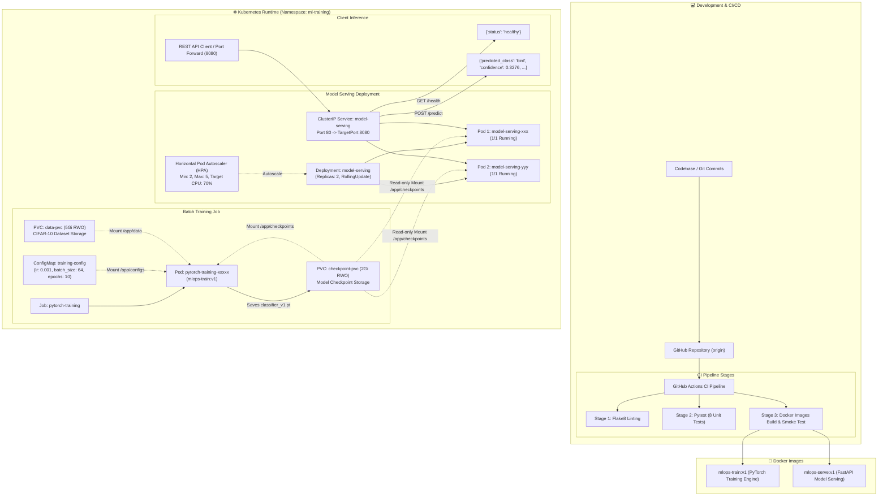

# Production PyTorch MLOps Pipeline: Training & Serving on Kubernetes

[](https://github.com/girinathbhatts/mlops-pytorch-pipeline/actions/workflows/ci.yml)
[](https://www.python.org/)
[](https://pytorch.org/)
[](https://fastapi.tiangolo.com/)
[](https://www.docker.com/)
[](https://kubernetes.io/)

---

## 👨‍🎓 Student Details
- **Student Name:** Girinath Bhatt S
- **Roll Number:** DA25M511
- **Course:** MLOps (Term 3), IIT Madras
- **Repository:** [https://github.com/girinathbhatts/mlops-pytorch-pipeline](https://github.com/girinathbhatts/mlops-pytorch-pipeline)

---

## 📖 Executive Summary

This repository contains an end-to-end, production-grade Machine Learning Operations (MLOps) pipeline designed for training and serving Deep Learning models (ResNet on CIFAR-10) using **PyTorch**, **Docker**, **Kubernetes (Minikube)**, and **GitHub Actions CI/CD**.

### Key System Features
- **PyTorch Training Engine:** ResNet architecture adapted for 32x32 CIFAR-10 image classification with validation metrics tracking, checkpointing, and early stopping.
- **Production Serving API:** High-throughput FastAPI application exposing `/health` liveness checks and `/predict` multipart image inference endpoints returning predicted class names, confidence scores, and full class probability distributions.
- **Multi-Stage Docker Containers:** Ultra-lean CPU-optimized containers with non-root security execution (`appuser`), pinned dependency constraints, and multi-stage build layers.
- **Kubernetes Orchestration:** Cloud-native architecture utilizing Namespaces (`ml-training`), ConfigMaps for dynamic hyperparameter management, PersistentVolumeClaims (PVC) for shared checkpoint storage, Batch Training Jobs, RollingUpdate Deployments with liveness/readiness probes, ClusterIP Services, and Horizontal Pod Autoscalers (HPA).
- **Automated CI/CD:** GitHub Actions workflows executing Flake8 linting, Pytest test suites (8 comprehensive unit & integration tests), and automated Docker container builds.

---

## 🏗️ Architecture & Workflow



---

## 📁 Repository Structure

```
mlops-pytorch-pipeline/
├── .github/
│   └── workflows/
│       └── ci.yml                   # CI pipeline (lint, test, build)
├── configs/
│   └── training_config.yaml         # Training hyperparameters configuration
├── docker/
│   ├── Dockerfile.train             # Training container image specification
│   └── Dockerfile.serve             # Production serving container image
├── k8s/
│   ├── namespace.yaml               # 'ml-training' namespace
│   ├── configmap.yaml               # Training hyperparameter configmap
│   ├── pvc.yaml                     # PersistentVolumeClaims for data & checkpoints
│   ├── training-job.yaml            # Kubernetes batch training job
│   ├── serving-deployment.yaml      # Model serving deployment with probes
│   ├── serving-service.yaml         # ClusterIP service for model serving
│   └── hpa.yaml                     # Horizontal Pod Autoscaler
├── requirements/
│   ├── train.txt                    # PyTorch training dependencies
│   └── serve.txt                    # FastAPI serving dependencies
├── scripts/
│   └── generate_test_image.py       # Helper to generate test inference PNG
├── src/
│   ├── __init__.py
│   ├── dataset.py                   # CIFAR-10 dataset loading & transforms
│   ├── model.py                     # ResNet PyTorch model architecture
│   ├── serve.py                     # FastAPI serving application
│   └── train.py                     # PyTorch training loop with checkpointing
├── tests/
│   ├── conftest.py                  # Pytest fixtures & synthetic data
│   └── test_model.py                # 8 comprehensive unit & integration tests
├── .dockerignore                    # Docker build exclusion rules
├── .gitignore                       # Git exclusion rules
├── README.md                        # Project documentation
├── test_image.png                   # Sample inference test image
├── validation_deployment.txt        # Kubernetes deployment verification output
├── validation_hpa.txt               # Kubernetes HPA verification output
├── validation_inference.txt         # End-to-end inference verification output
├── validation_pods.txt              # Kubernetes pods verification output
├── validation_service.txt           # Kubernetes service verification output
├── validation_storage.txt           # Kubernetes storage PVC verification output
└── validation_training_logs.txt     # Kubernetes training job logs
```

---

## ⚡ Prerequisites & Installation

### System Requirements
- **OS:** Windows 10/11, macOS, or Linux
- **RAM:** Minimum 16 GB
- **Tools:** Docker Desktop (v24.0+), Minikube (v1.34+), Kubectl (v1.30+), Python 3.11+

### Local Environment Setup
```bash
# 1. Clone repository
git clone https://github.com/girinathbhatts/mlops-pytorch-pipeline.git
cd mlops-pytorch-pipeline

# 2. Create and activate virtual environment
python -m venv venv
# Windows PowerShell:
.\venv\Scripts\Activate.ps1
# Linux/macOS:
source venv/bin/activate

# 3. Install dependencies
pip install --upgrade pip
pip install -r requirements/train.txt
pip install -r requirements/serve.txt
pip install pytest flake8 requests
```

---

## 🧪 Testing & Code Quality

Run linting and test suites locally:
```bash
# Code style and syntax linting
flake8 src/ tests/

# Execute all unit and integration tests
pytest tests/ -v
```

### Test Suite Summary (8/8 Passed)
- `test_model_instantiation`: Verifies ResNet18 model initialization and parameter count.
- `test_model_forward_pass_shape`: Verifies input tensor `(B, 3, 32, 32)` produces `(B, 10)` logits.
- `test_dataset_loading`: Validates CIFAR-10 data loaders, batching, and tensor normalization.
- `test_train_one_epoch_synthetic`: Tests the full training loop with backpropagation on synthetic batches.
- `test_evaluate_synthetic`: Tests model evaluation and accuracy calculation.
- `test_checkpoint_saving_and_loading`: Verifies `torch.save` and state dictionary deserialization.
- `test_serve_health_endpoint`: Tests FastAPI `/health` endpoint status.
- `test_serve_predict_endpoint`: Tests `/predict` with multipart image payload and response schema.

---

## 🐳 Docker Containerization

### Building Images
```bash
# 1. Build training image
docker build -f docker/Dockerfile.train -t mlops-train:v1 .

# 2. Build serving image
docker build -f docker/Dockerfile.serve -t mlops-serve:v1 .
```

### Running Locally with Docker
```bash
# Run training with mounted volumes
docker run --rm \
  -v "${PWD}/data:/app/data" \
  -v "${PWD}/checkpoints:/app/checkpoints" \
  mlops-train:v1

# Run serving container
docker run -d --name mlops-serve -p 8080:8080 \
  -v "${PWD}/checkpoints:/app/checkpoints" \
  mlops-serve:v1

# Test endpoints
curl http://localhost:8080/health
python -c "import requests; print(requests.post('http://localhost:8080/predict', files={'image': open('test_image.png', 'rb')}).json())"

# Cleanup
docker stop mlops-serve && docker rm mlops-serve
```

---

## ☸️ Kubernetes Deployment (Minikube)

### 1. Start Minikube & Load Images
```bash
minikube start --driver=docker --cpus=4 --memory=6144 --disk-size=20g

# Load local Docker images into Minikube cluster
minikube image load mlops-train:v1
minikube image load mlops-serve:v1
```

### 2. Apply Kubernetes Manifests
```bash
# Create namespace, configs, and storage
kubectl apply -f k8s/namespace.yaml
kubectl apply -f k8s/configmap.yaml
kubectl apply -f k8s/pvc.yaml

# Run batch training job
kubectl apply -f k8s/training-job.yaml

# Deploy serving deployment, service, and HPA
kubectl apply -f k8s/serving-deployment.yaml
kubectl apply -f k8s/serving-service.yaml
kubectl apply -f k8s/hpa.yaml
```

### 3. Verify Cluster Resources
```bash
kubectl get all -n ml-training
kubectl get pvc,pv -n ml-training
kubectl get hpa -n ml-training
```

---

## 📊 Verification & Validation Results

### 1. Kubernetes Pods Status (`kubectl get pods -n ml-training -o wide`)
```
NAME                            READY   STATUS    RESTARTS   AGE   IP           NODE       NOMINATED NODE   READINESS GATES
model-serving-998f4665b-6k4q2   1/1     Running   0          84s   10.244.0.5   minikube   <none>           <none>
model-serving-998f4665b-ck4rb   1/1     Running   0          84s   10.244.0.6   minikube   <none>           <none>
pytorch-training-s7pkl          1/1     Running   0          85s   10.244.0.4   minikube   <none>           <none>
```

### 2. Horizontal Pod Autoscaler (`kubectl get hpa -n ml-training`)
```
NAME                REFERENCE                  TARGETS              MINPODS   MAXPODS   REPLICAS   AGE
model-serving-hpa   Deployment/model-serving   cpu: <unknown>/70%   2         5         2          85s
```

### 3. Persistent Volumes & PVCs (`kubectl get pvc,pv -n ml-training`)
```
NAME                                   STATUS   VOLUME                                     CAPACITY   ACCESS MODES   STORAGECLASS   AGE
persistentvolumeclaim/checkpoint-pvc   Bound    pvc-ca0f1292-361b-4aa6-9c57-28627eef3f90   2Gi        RWO            standard       4m24s
persistentvolumeclaim/data-pvc         Bound    pvc-df0a0b6e-7874-44e2-86de-dd6f2c4b58b3   5Gi        RWO            standard       4m24s
```

### 4. Training Convergence & Metrics
```json
{"epoch": 1, "train_loss": 1.3748, "train_accuracy": 0.4942, "val_loss": 1.1071, "val_accuracy": 0.621}
{"epoch": 2, "train_loss": 0.8804, "train_accuracy": 0.691, "val_loss": 0.7561, "val_accuracy": 0.7377}
{"epoch": 3, "train_loss": 0.6877, "train_accuracy": 0.762, "val_loss": 0.6096, "val_accuracy": 0.792}
{"epoch": 4, "train_loss": 0.5751, "train_accuracy": 0.802, "val_loss": 0.6119, "val_accuracy": 0.7889}
{"epoch": 5, "train_loss": 0.501, "train_accuracy": 0.8261, "val_loss": 0.5661, "val_accuracy": 0.811}
{"epoch": 6, "train_loss": 0.4455, "train_accuracy": 0.8466, "val_loss": 0.4717, "val_accuracy": 0.8413}
{"epoch": 7, "train_loss": 0.4009, "train_accuracy": 0.86, "val_loss": 0.4224, "val_accuracy": 0.857}
{"epoch": 8, "train_loss": 0.3647, "train_accuracy": 0.8732, "val_loss": 0.4138, "val_accuracy": 0.8619}
{"epoch": 9, "train_loss": 0.3318, "train_accuracy": 0.8844, "val_loss": 0.399, "val_accuracy": 0.8675}
{"epoch": 10, "train_loss": 0.3034, "train_accuracy": 0.8949, "val_loss": 0.4113, "val_accuracy": 0.8653}
{"event": "training_complete", "best_val_loss": 0.399}
```

### 5. Live Inference Verification via Kubernetes ClusterIP Service
```bash
# Port-forward service
kubectl port-forward svc/model-serving -n ml-training 8080:80

# GET /health
curl -X GET http://localhost:8080/health
# Response:
{
  "status": "healthy"
}

# POST /predict
curl -X POST -F "image=@test_image.png" http://localhost:8080/predict
# Response:
{
  "predicted_class": "bird",
  "confidence": 0.3276,
  "probabilities": {
    "airplane": 0.0045,
    "automobile": 0.1787,
    "bird": 0.3276,
    "cat": 0.0378,
    "deer": 0.0009,
    "dog": 0.0014,
    "frog": 0.2062,
    "horse": 0.001,
    "ship": 0.0037,
    "truck": 0.2381
  }
}
```

---

## 🌟 Bonus Features Implemented
1. **Horizontal Pod Autoscaler (HPA):** Auto-scales serving replicas (2 to 5) dynamically based on 70% CPU threshold (`k8s/hpa.yaml`).
2. **Early Stopping with Checkpoint Rollback:** Automatically tracks validation loss across epochs and saves the optimal model checkpoint (`classifier_v1.pt`).
3. **Structured JSON-Lines Logging:** Production observability with machine-parsable JSON events for monitoring training progress and loss metrics.
4. **GPU-Ready Deployment Manifests:** Embedded GPU node selector, tolerations, and resource limit comments in `k8s/training-job.yaml` for instant cloud GPU execution.

---

## 📄 License & Attribution
Developed by **Girinath Bhatt S** (Roll No: `DA25M511`) for the MLOps Course, IIT Madras.
Code released under the MIT License.
