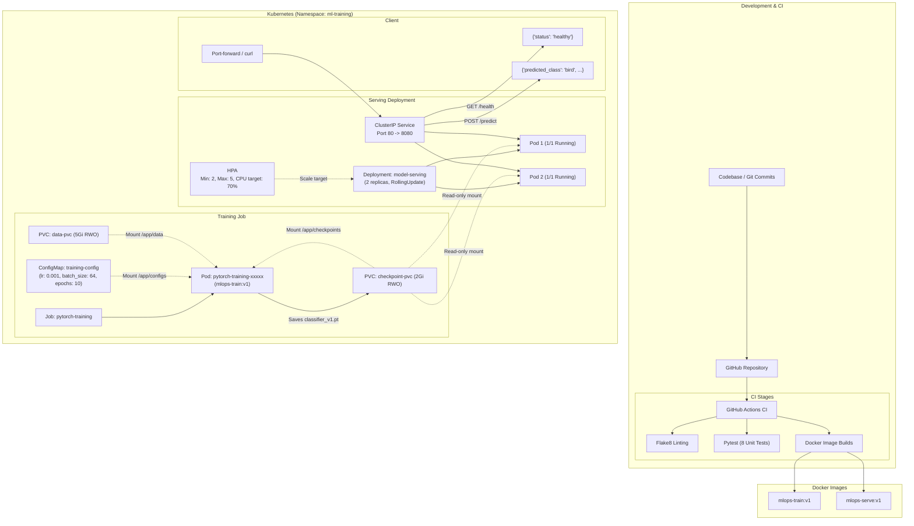

# PyTorch MLOps Pipeline — CIFAR-10 Training & Serving on Kubernetes

[](https://github.com/girinathbhatts/mlops-pytorch-pipeline/actions/workflows/ci.yml)
[](https://www.python.org/)
[](https://pytorch.org/)
[](https://fastapi.tiangolo.com/)
[](https://www.docker.com/)
[](https://kubernetes.io/)

---

## Student Details
- **Name:** Girinath Bhatt S
- **Roll Number:** DA25M511
- **Course:** MLOps (Term 3), IIT Madras
- **Repository:** [https://github.com/girinathbhatts/mlops-pytorch-pipeline](https://github.com/girinathbhatts/mlops-pytorch-pipeline)

---

## Overview

This repository implements an end-to-end MLOps pipeline for training and serving a ResNet-18 image classifier on CIFAR-10. It covers the full deployment lifecycle — from local development with Git workflows, to containerized training and serving with Docker, to orchestrated deployment on Kubernetes (Minikube).

### Features
- **PyTorch training script:** ResNet-18 adapted for 32×32 CIFAR-10 images, with validation tracking, best-checkpoint saving, and early stopping.
- **Model serving API:** FastAPI application exposing `/health` and `/predict` endpoints. Accepts an image and returns the predicted class, confidence score, and per-class probabilities.
- **Docker containers:** Separate training and serving images with pinned dependencies. The serving image runs as a non-root user (`appuser`) and includes a `HEALTHCHECK`.
- **Kubernetes deployment:** Namespace (`ml-training`), ConfigMap for hyperparameters, PersistentVolumeClaims for dataset and checkpoint storage, a batch training Job, a serving Deployment with liveness/readiness probes, a ClusterIP Service, and a Horizontal Pod Autoscaler.
- **CI pipeline:** GitHub Actions workflow running Flake8 linting, Pytest (8 unit tests), and Docker image builds on every push/PR.

---

## Architecture



---

## Repository Structure

```
mlops-pytorch-pipeline/
├── .github/
│   └── workflows/
│       └── ci.yml                   # CI pipeline (lint, test, build)
├── configs/
│   └── training_config.yaml         # Training hyperparameters
├── docker/
│   ├── Dockerfile.train             # Multi-stage training image
│   └── Dockerfile.serve             # Serving image (non-root)
├── evidence/
│   ├── k8s-pods.txt                 # kubectl get pods output
│   ├── k8s-deployment.txt           # kubectl describe deployment output
│   ├── k8s-job.txt                  # kubectl get/describe job output
│   ├── k8s-hpa.txt                  # kubectl get hpa output
│   ├── k8s-storage.txt              # kubectl get pvc,pv output
│   ├── k8s-service.txt              # kubectl get svc output
│   ├── k8s-training-logs.txt        # Training job logs
│   └── k8s-inference.txt            # /health and /predict responses
├── k8s/
│   ├── namespace.yaml               # ml-training namespace
│   ├── configmap.yaml               # Training hyperparameter ConfigMap
│   ├── pvc.yaml                     # PVCs for data & checkpoints
│   ├── training-job.yaml            # Batch training Job
│   ├── serving-deployment.yaml      # Serving Deployment with probes
│   ├── serving-service.yaml         # ClusterIP Service
│   └── hpa.yaml                     # Horizontal Pod Autoscaler
├── requirements/
│   ├── train.txt                    # Training dependencies (PyTorch, PyYAML)
│   └── serve.txt                    # Serving dependencies (FastAPI, Uvicorn)
├── scripts/
│   └── generate_test_image.py       # Generates a test PNG for inference
├── src/
│   ├── dataset.py                   # CIFAR-10 data loading & transforms
│   ├── model.py                     # ResNet model definition
│   ├── serve.py                     # FastAPI serving application
│   └── train.py                     # Training loop with checkpointing
├── tests/
│   ├── conftest.py                  # Pytest path configuration
│   └── test_model.py                # Unit tests for model and transforms
├── .dockerignore
├── .gitignore
├── README.md
├── REFLECTION.md                    # Write-up reflecting on key challenges
└── test_image.png                   # Sample image for testing /predict
```

---

## Prerequisites

- **OS:** Windows 10/11, macOS, or Linux
- **RAM:** 16 GB recommended
- **Tools:** Docker Desktop (v24.0+), Minikube (v1.34+), kubectl (v1.30+), Python 3.11+

### Local Setup
```bash
# Clone repository
git clone https://github.com/girinathbhatts/mlops-pytorch-pipeline.git
cd mlops-pytorch-pipeline

# Create virtual environment
python -m venv venv
# Windows PowerShell:
.\venv\Scripts\Activate.ps1
# Linux/macOS:
source venv/bin/activate

# Install dependencies
pip install --upgrade pip
pip install -r requirements/train.txt
pip install -r requirements/serve.txt
pip install pytest flake8 requests
```

---

## Testing & Code Quality

```bash
# Lint
flake8 src/ tests/

# Run unit tests
pytest tests/ -v
```

### Test Suite (8/8 Passed)
- `test_resnet18_creation` — Verifies ResNet-18 model instantiation.
- `test_resnet18_output_shape` — Checks that input `(B, 3, 32, 32)` produces `(B, 10)` output.
- `test_resnet34_creation` — Verifies ResNet-34 model instantiation.
- `test_custom_num_classes` — Tests model with a different number of output classes.
- `test_unknown_architecture_raises` — Ensures `ValueError` for unsupported architecture names.
- `test_model_save_and_load` — Tests checkpoint save/load round-trip and output consistency.
- `test_train_transforms` — Validates training augmentation pipeline has 4 transforms (flip, crop, tensor, normalize).
- `test_eval_transforms` — Validates evaluation pipeline has 2 transforms (tensor, normalize).

---

## Docker Containerization

### Building Images
```bash
# Build training image (multi-stage)
docker build -f docker/Dockerfile.train -t mlops-train:v1 .

# Build serving image
docker build -f docker/Dockerfile.serve -t mlops-serve:v1 .
```

### Running Locally
```bash
# Run training with mounted volumes
docker run --rm \
  -v "${PWD}/data:/app/data" \
  -v "${PWD}/checkpoints:/app/checkpoints" \
  mlops-train:v1

# Run serving container
docker run -d --name mlops-serve -p 8080:8080 \
  -v "${PWD}/checkpoints:/app/checkpoints" \
  mlops-serve:v1

# Test endpoints
curl http://localhost:8080/health
curl -X POST -F "image=@test_image.png" http://localhost:8080/predict

# Cleanup
docker stop mlops-serve && docker rm mlops-serve
```

---

## Kubernetes Deployment (Minikube)

### 1. Start Minikube & Load Images
```bash
minikube start --driver=docker --cpus=4 --memory=6144 --disk-size=20g

# Load local Docker images into Minikube
minikube image load mlops-train:v1
minikube image load mlops-serve:v1
```

### 2. Apply Manifests & Run Training
```bash
# Create namespace, ConfigMap, and storage
kubectl apply -f k8s/namespace.yaml
kubectl apply -f k8s/configmap.yaml
kubectl apply -f k8s/pvc.yaml

# Start training job
kubectl apply -f k8s/training-job.yaml

# Wait for training to complete before deploying serving
kubectl wait --for=condition=complete job/pytorch-training -n ml-training --timeout=30m
```

### 3. Deploy Serving Layer
```bash
# Deploy serving only after training has finished
kubectl apply -f k8s/serving-deployment.yaml
kubectl apply -f k8s/serving-service.yaml
kubectl apply -f k8s/hpa.yaml
```

### 4. Verify Resources
```bash
kubectl get all -n ml-training
kubectl get pvc,pv -n ml-training
kubectl get hpa -n ml-training
```

### 5. Test Inference
```bash
# Port-forward the service
kubectl port-forward svc/model-serving -n ml-training 8080:80

# In another terminal:
curl http://localhost:8080/health
curl -X POST -F "image=@test_image.png" http://localhost:8080/predict
```

---

## Validation Results

The outputs below were captured from an actual Minikube deployment. Full terminal logs are available in the [`evidence/`](evidence/) directory.

### Kubernetes Pods
```
NAME                            READY   STATUS      RESTARTS   AGE
model-serving-998f4665b-6k4q2   1/1     Running     0          15h
model-serving-998f4665b-ck4rb   1/1     Running     0          15h
pytorch-training-s7pkl          0/1     Completed   0          15h
```

### HPA Status
```
NAME                REFERENCE                  TARGETS              MINPODS   MAXPODS   REPLICAS   AGE
model-serving-hpa   Deployment/model-serving   cpu: <unknown>/70%   2         5         2          85s
```
> **Note:** Minikube's metrics-server did not report CPU metrics during this run, so the HPA target shows `<unknown>`. The autoscaler is configured but dynamic CPU-based scaling was not observed.

### Storage (PVCs)
```
NAME                                   STATUS   VOLUME                                     CAPACITY   ACCESS MODES   STORAGECLASS   AGE
persistentvolumeclaim/checkpoint-pvc   Bound    pvc-ca0f1292-361b-4aa6-9c57-28627eef3f90   2Gi        RWO            standard       4m24s
persistentvolumeclaim/data-pvc         Bound    pvc-df0a0b6e-7874-44e2-86de-dd6f2c4b58b3   5Gi        RWO            standard       4m24s
```

### Training Metrics
```json
{"epoch": 1, "train_loss": 1.3581, "train_accuracy": 0.5069, "val_loss": 1.3461, "val_accuracy": 0.5523}
{"epoch": 2, "train_loss": 0.8717, "train_accuracy": 0.6926, "val_loss": 0.7355, "val_accuracy": 0.7432}
{"epoch": 3, "train_loss": 0.6841, "train_accuracy": 0.7619, "val_loss": 0.7192, "val_accuracy": 0.7522}
{"epoch": 4, "train_loss": 0.5723, "train_accuracy": 0.8022, "val_loss": 0.7295, "val_accuracy": 0.7671}
{"epoch": 5, "train_loss": 0.5046, "train_accuracy": 0.825, "val_loss": 0.4988, "val_accuracy": 0.833}
{"epoch": 6, "train_loss": 0.4455, "train_accuracy": 0.845, "val_loss": 0.4858, "val_accuracy": 0.8378}
{"epoch": 7, "train_loss": 0.3994, "train_accuracy": 0.8629, "val_loss": 0.5426, "val_accuracy": 0.8172}
{"epoch": 8, "train_loss": 0.3656, "train_accuracy": 0.8744, "val_loss": 0.4502, "val_accuracy": 0.8474}
{"epoch": 9, "train_loss": 0.3286, "train_accuracy": 0.8878, "val_loss": 0.3931, "val_accuracy": 0.8711}
{"epoch": 10, "train_loss": 0.3016, "train_accuracy": 0.8951, "val_loss": 0.3753, "val_accuracy": 0.878}
{"event": "training_complete", "best_val_loss": 0.3753}
```

Best validation accuracy: **87.80%** at epoch 10 (val_loss: 0.3753).

### Inference via Kubernetes Service
```bash
# GET /health
curl http://localhost:8080/health
{"status": "healthy"}

# POST /predict
curl -X POST -F "image=@test_image.png" http://localhost:8080/predict
{
  "predicted_class": "bird",
  "confidence": 0.3276,
  "probabilities": {
    "airplane": 0.0045,
    "automobile": 0.1787,
    "bird": 0.3276,
    "cat": 0.0378,
    "deer": 0.0009,
    "dog": 0.0014,
    "frog": 0.2062,
    "horse": 0.001,
    "ship": 0.0037,
    "truck": 0.2381
  }
}
```

---

## Additional Features
1. **Horizontal Pod Autoscaler (HPA):** Configured for 2–5 replicas targeting 70% CPU utilization (`k8s/hpa.yaml`). In the Minikube validation, metrics-server did not report CPU metrics, so dynamic scaling was not observed during testing.
2. **Early stopping and best-checkpoint saving:** Training monitors validation loss and saves the best checkpoint to disk. If validation loss does not improve for 3 consecutive epochs, training stops early.
3. **Structured JSON logging:** Training outputs one JSON object per epoch, making it straightforward to parse metrics programmatically.
4. **GPU configuration template:** `k8s/training-job.yaml` includes commented GPU resource requests (`nvidia.com/gpu: 1`), node selector, and tolerations that can be uncommented for GPU-enabled clusters. GPU scheduling was not validated in the current Minikube environment.

---

## License & Attribution
Developed by **Girinath Bhatt S** (Roll No: `DA25M511`) for the MLOps Course, IIT Madras.
